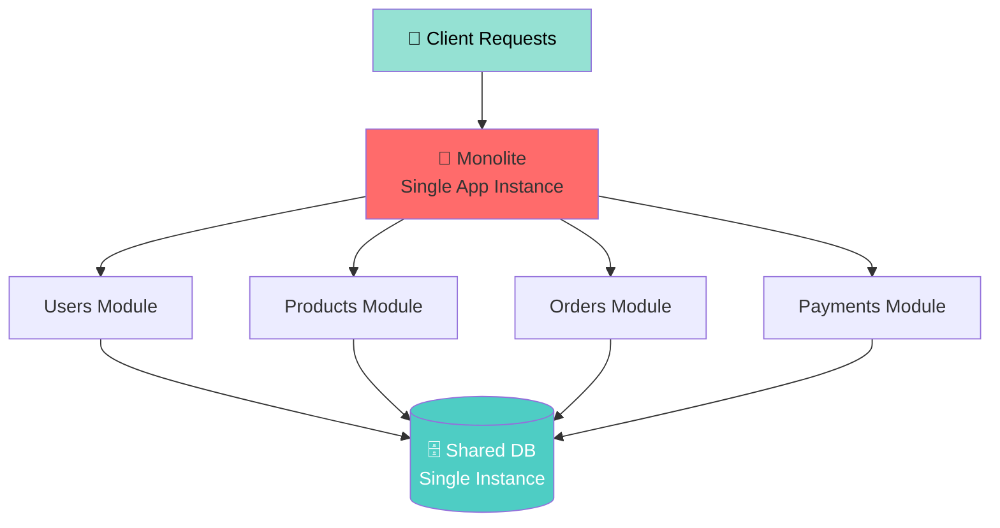
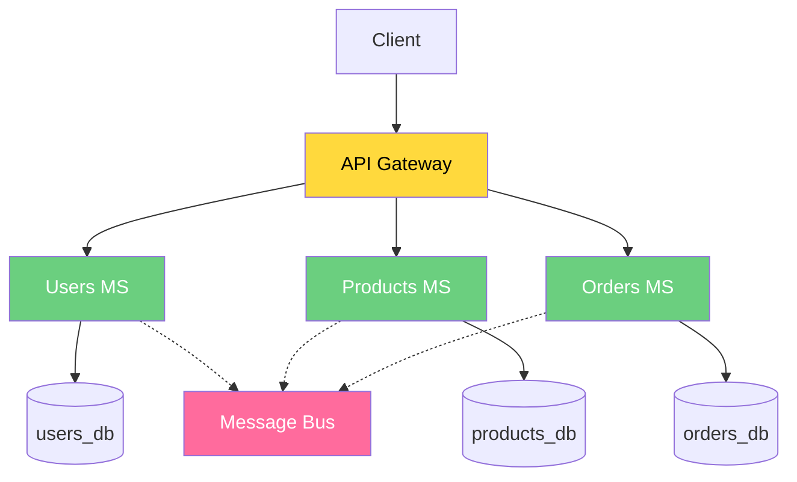
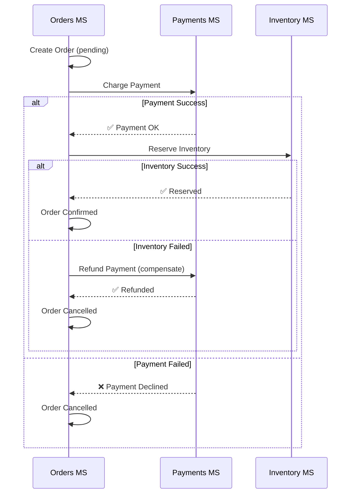

Durante il mio lavoro come Technical Leader in Websolute, ho guidato l'evoluzione di molteplici sistemi da architettura monolitica a microservizi. Questa transizione non è solo una scelta tecnologica, ma un cambio di paradigma organizzativo.

## Architettura monolitica: vantaggi e limiti



### Vantaggi
- ✅ Semplice da deployare (un'unica release)
- ✅ Facile debugging (stack trace lineare)
- ✅ Performance ottima (no network overhead)
- ✅ Ideale per MVP e piccole team

### Limiti
- ❌ Scaling granulare difficile
- ❌ Una failure impatta tutto
- ❌ Linguaggi/framework locked-in
- ❌ Deploying è rischioso (tutti gli aggiornamenti insieme)
- ❌ Scalare il team è complicato

## Transizione a microservizi



## Fasi della migrazione

### Fase 1: Strangler Pattern
Sostituire gradualmente parti del monolite:

```
Client → Proxy/Gateway
           ├→ Nuovo Servizio (v1)
           └→ Monolite Legacy (v2, deprecato)
```

Vantaggi:
- Basso rischio
- Possibilità di rollback
- Team può lavorare in parallelo

### Fase 2: Database per servizio
Ogni microservizio ha il suo database. Schema separato, proprietary:

```
┌─────────────────┐  ┌─────────────────┐
│ Users MS        │  │ Products MS     │
│ ┌─────────────┐ │  │ ┌─────────────┐ │
│ │ users_db    │ │  │ │ products_db │ │
│ │ Schema: U   │ │  │ │ Schema: P   │ │
│ └─────────────┘ │  │ └─────────────┘ │
└─────────────────┘  └─────────────────┘
```

**Regola d'oro**: Un servizio scrive solo su suo DB. Solo lettura da altri (via API).

### Fase 3: Comunicazione asincrona
Per decoupling e resilienza:

```
┌──────────────┐
│ Orders MS    │
│ Crea ordine  │
│ Pubblica:    │
│ "OrderCreated"
└────────┬─────┘
         │
    [Message Bus]
    RabbitMQ/Kafka
         │
    ┌────┴──────────┐
    │               │
┌───▼────────┐  ┌───▼────────┐
│ Inventory  │  │ Billing    │
│ Consuma    │  │ Consuma    │
│ "OrderCreated" │ "OrderCreated"
└────────────┘  └────────────┘
```

## Sfide comuni e soluzioni

### 1. **Distributed Transactions**

Problema: Come garantire consistenza quando un ordine coinvolge 3 servizi?

Soluzione: **Saga Pattern**



### 2. **Network Latency**

Problema: Ogni chiamata tra servizi ha latenza.

Soluzione: 
- Caching aggressivo (Redis)
- Batch operations
- GraphQL / Data loader
- Event sourcing per consistency

### 3. **Monitoraggio e Debugging**

Problema: Un errore attraversa 5 servizi, come lo trovo?

Soluzione:
- **Distributed tracing** (Jaeger, Zipkin)
- **Centralized logging** (ELK, Loki)
- **Metrics** (Prometheus)
- **Correlation IDs** in ogni request

```
Request ID: abc-123-def
  ├→ API Gateway [10ms]
  ├→ Users MS [45ms]
  ├→ Products MS [32ms]
  └→ Orders MS [78ms]
Total: 165ms (bottleneck: Orders)
```

## Quando usare microservizi

| Aspetto | Monolite | Microservizi |
|---------|----------|-------------|
| **Deployment** | 📦 Unico, atomico | 🚀 Indipendente per servizio |
| **Scaling** | ⚖️ Tutto insieme | 🎯 Granulare per modulo |
| **Failure** | ⚠️ Tutta app giù | 🔒 Isolato a un servizio |
| **Latency** | ⚡ Minima (in-process) | 🌐 Network overhead |
| **Complessità** | 📚 Bassa | 🔧 Altissima |
| **Team Size** | 👥 5-15 persone | 👥👥 20+ persone |
| **Debugging** | 🔍 Stack trace semplice | 🔎 Distributed tracing |
| **Testing** | ✅ Facile | 🧪 Integration test complessi |

### ✅ **Buoni candidati:**
- Team grandi (>20 persone)
- Diverse aree di business
- Scaling requirements asimmetrici
- Tecnologie diverse necessarie

### ❌ **Sconsigliato:**
- Team piccoli (<5 persone)
- Prototipo/MVP
- Requisiti molto accoppiati
- Poca esperienza con deployment

## Stack che abbiamo usato in Websolute

- **API Gateway**: Ocelot / Kong
- **Message Bus**: RabbitMQ (considerando Kafka)
- **Service Mesh**: Istio (per versioning/canary)
- **Container Orchestration**: Kubernetes
- **Observability**: ELK + Prometheus + Grafana
- **Framework**: .NET Core + ASP.NET Core

La migrazione a microservizi è un viaggio, non una destinazione. Non è "everything or nothing" - si può avere un'architettura ibrida dove alcune parti rimangono monolitiche se ha senso.
