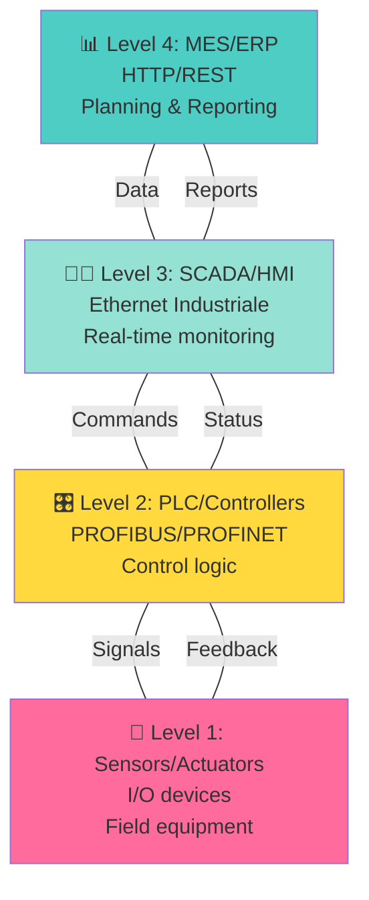

L'automazione industriale è il fondamento della produzione moderna. Una soluzione di automazione completa integra programmazione PLC, sistemi SCADA, sensori intelligenti e comunicazione di rete per creare linee produttive efficienti, affidabili e tracciabili.

## Livelli dell'automazione industriale



## Programmazione PLC: Linguaggi IEC 61131-3

I PLC moderni si programmano secondo lo standard IEC 61131-3, che definisce 5 linguaggi:

### 1. **Ladder Diagram (LD)**
Rappresentazione grafica simile ai schemi elettrici tradizionali. Ideale per:
- Logica combinatoria semplice
- Controllori legacy
- Operatori con background elettrico

### 2. **Structured Text (ST)**
Linguaggio testuale simile a Pascal/C. Perfetto per:
- Algoritmi complessi
- Elaborazione dati
- Controllo di processi continui

### 3. **Function Block Diagram (FBD)**
Grafico con blocchi funzionali e connessioni. Utile per:
- Riutilizzo di componenti
- Modularità
- Visualizzazione del flusso

### 4. **Instruction List (IL)** (deprecato)
Linguaggio assembly-like, raramente usato in nuovi progetti.

### 5. **Sequential Function Chart (SFC)**
Diagrammi di stato per sequenze complesse.

## Ciclo di un programma PLC

```
┌──────────────────┐
│  Leggi input     │  (~2-5 ms)
│  (Scan Input)    │
└────────┬─────────┘
         │
┌────────▼─────────┐
│ Esegui logica    │  (Tempo variabile)
│ (Solve Logic)    │
└────────┬─────────┘
         │
┌────────▼─────────┐
│ Scrivi output    │  (~2-5 ms)
│ (Scan Output)    │
└────────┬─────────┘
         │
    Ciclo di scan: 10-50 ms tipico
         │
         └────────────┘
```

Ogni ciclo il PLC:
1. Legge lo stato di tutti gli input
2. Esegue il programma logico
3. Aggiorna gli output
4. Comunica con dispositivi remoti

## Comunicazione industriale: Protocolli principali

**PROFIBUS DP** (Classic, ma ancora diffuso)
- Campo: sensori, attuatori, periferie I/O
- Velocità: fino a 12 Mbps
- Distanza: fino a 1200 m

**PROFINET IO** (Presente)
- Standard: Ethernet industriale
- Real-time: deterministica (<1 ms)
- Integrazione IT/OT più semplice

**EtherCAT** (Emergente, ad alta performance)
- Ultrabassa latenza (<1 μs)
- Master-slave con elaborazione in linea
- Perfetto per applicazioni sync critiche

**Modbus/TCP** (Semplice, legacy)
- Client-server su Ethernet standard
- Bassa latenza, affidabile
- Limitato a poche centinaia di variabili

## Integrazione SCADA

Il SCADA raccoglie dati dai PLC e fornisce all'operatore:
- **Dashboard** con trend real-time
- **Allarmi** configurabili per anomalie
- **Ricette di produzione** scaricabili sul PLC
- **Report** per analisi e conformità
- **Audit trail** per tracciabilità

## Considerazioni di sicurezza

Ogni sistema di automazione deve includere:
- **Safety integrity level (SIL)** adeguato
- **Funzioni di emergenza** dedicate
- **Validazione** della logica critica
- **Protezione** da accessi non autorizzati
- **Backup** e disaster recovery

L'automazione industriale non è solo efficienza: è la base per costruire fabbriche intelligenti, prevedibili e tracciabili.
