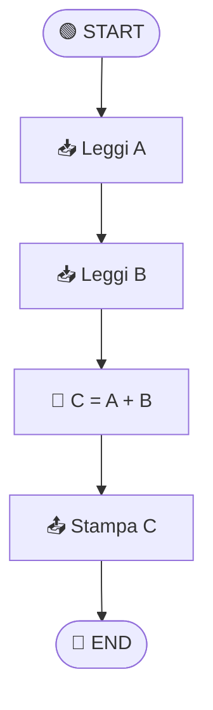

Un diagramma di flusso è una rappresentazione visuale di un algoritmo. Prima che gli studenti scrivano una singola riga di codice, disegnare il flusso logico aiuta a:
- Chiarire il pensiero
- Identificare i problemi di logica
- Comunicare l'idea agli altri
- Rendere il codice più facile da scrivere

## Simboli standard (ISO 5807)

```
┌─────────────┐
│   Inizio    │  Oval: Start/End
└──────┬──────┘

┌──────────────┐
│   Processo   │  Rettangolo: Azione (assegnamento, calcolo)
│ x = x + 1    │
└──────┬───────┘

  Sì ◄─────────┐
   │           │
┌──┴───────┐   │
│ Condizione?│  Rombo: Decisione (if)
└──┬───────┘   │
   │           │
   No ─────────┘

┌──────────┐
│  Input   │  Parallelogramma: Input/Output
│  Leggi n │
└────┬─────┘

     ↓
  Freccia: Flusso (direzione)
```

## Esempio 1: Algoritmo semplice

**Programma:** Somma di due numeri



## Esempio 2: Decisione (if)

**Programma:** Determina se numero è pari o dispari

```
       START
         │
         ▼
    Leggi N
         │
         ▼
    N % 2 == 0?  ◄─── Condizione (modulo)
    ╱          ╲
  SÌ            NO
  │             │
  ▼             ▼
Stampa        Stampa
"Pari"        "Dispari"
  │             │
  └──────┬──────┘
         ▼
        END
```

## Esempio 3: Ciclo (loop)

**Programma:** Somma numeri da 1 a N

```
       START
         │
         ▼
    Leggi N
         │
         ▼
   somma = 0
   i = 1
         │
         ▼
    i ≤ N?  ◄──────┐  Condizione del ciclo
    │              │
  SÌ               │
    ▼              │
 somma =      NO   │
 somma + i         │
    ▼              │
  i = i + 1  ──────┘
         │
         ▼
   Stampa somma
         │
         ▼
        END

Traccia con N=3:
i=1: somma=1
i=2: somma=3
i=3: somma=6
i=4: i>3, esci
Output: 6 ✓
```

## Esempio 4: Ciclo annidato (nested)

**Programma:** Stampa tabellina

```
       START
         │
         ▼
    i = 1
         │
         ▼
    i ≤ 10?  ◄────────────┐
    │                     │
  SÌ                      │
    ▼                     │
   j = 1                  │
    │                     │
    ▼                     │
   j ≤ 10?  ◄────┐       │
   │             │       │
 SÌ              │       │
   ▼             │       │
Stampa        NO │       │
i * j         │  │       │
   │          │  │       │
   ▼          │  │       │
 j = j+1  ────┘  │       │
               NO │       │
                  ▼       │
               i = i+1 ────┘
                  │
                  ▼
                 END

Output:
1  2  3  ...  10
2  4  6  ...  20
...
10 20 30 ... 100
```

## Esempio 5: Ricerca (Linear Search)

**Programma:** Trova posizione di X in lista

```
         START
           │
           ▼
   Leggi lista, X
           │
           ▼
    i = 0
  trovato = NO
           │
           ▼
    i < lunghezza?  ◄────────┐
    │                        │
  SÌ                         │
    ▼                        │
  lista[i] == X?            │
  ╱              ╲          │
SÌ               NO         │
│                │          │
▼                ▼          │
trovato=YES   i = i+1  ─────┘
│
└──┬──────┘
   │
   ▼
trovato?
╱        ╲
SÌ       NO
│        │
▼        ▼
Stampa  Stampa
"Trovato" "Non trovato"
│        │
└───┬────┘
    ▼
   END
```

## Strumenti per disegnare diagrammi

### Carta e penna
✅ Migliore per insegnamento in classe
✅ Zero dipendenze tecnologiche
✅ Veloce per prototipi

### Lucidchart / Draw.io
✅ Online, gratis
✅ Simboli predefiniti
✅ Esportazione (PNG, PDF)

### Microsoft Visio
✅ Professionale
❌ A pagamento
❌ Pesante

### Graphviz (da codice)
```
digraph Pari {
  start [shape=oval];
  leggi [shape=box, label="Leggi N"];
  cond [shape=diamond, label="N % 2 == 0?"];
  pari [shape=box, label="Stampa Pari"];
  dispari [shape=box, label="Stampa Dispari"];
  end [shape=oval];
  
  start -> leggi -> cond;
  cond -> pari [label="Sì"];
  cond -> dispari [label="No"];
  pari -> end;
  dispari -> end;
}
```
Genera diagramma automaticamente: `dot -Tpng diagram.dot -o diagram.png`

## Best practices didattiche

### ✅ Fai
```
- Usa simboli standard
- Una operazione per simbolo
- Frecce chiare (verticale/orizzontale)
- Commenti per logica complessa
- Traccia manuale (test il diagramma)
```

### ❌ Evita
```
- Simboli inventati
- Troppe operazioni in un box
- Frecce diagonali/caotiche
- Troppe linee che si incrociano
- Diagrammi senza fine (loop infinito senza uscita)
```

## Esercizio: Converti il diagramma in codice

Dopo aver disegnato il diagramma di flusso, il passo successivo è convertirlo in codice.

**Diagramma di flusso** (già disegnato)
```
START → Leggi N → N pari? → Stampa → END
                 Sì/No
```

**Python:**
```python
n = int(input("Inserisci numero: "))

if n % 2 == 0:
    print("Pari")
else:
    print("Dispari")
```

**JavaScript:**
```javascript
let n = parseInt(prompt("Inserisci numero: "));

if (n % 2 === 0) {
    console.log("Pari");
} else {
    console.log("Dispari");
}
```

La logica è identica! Il diagramma è la stessa per tutti i linguaggi.

## Perché i diagrammi di flusso sono ancora importanti?

```
Generazione prima (anni 70-80):
Diagrammi di flusso → Codice

Generazione oggi (AI, cloud, microservizi):
Ancora usiamo diagrammi di flusso per:
├─ Spiegare processi complessi
├─ Documntare sistemi
├─ Comunicare con non-programmatori
├─ Didattica (insegnare la logica)
└─ Project planning
```

Il diagramma di flusso è il "linguaggio universale" della programmazione.
