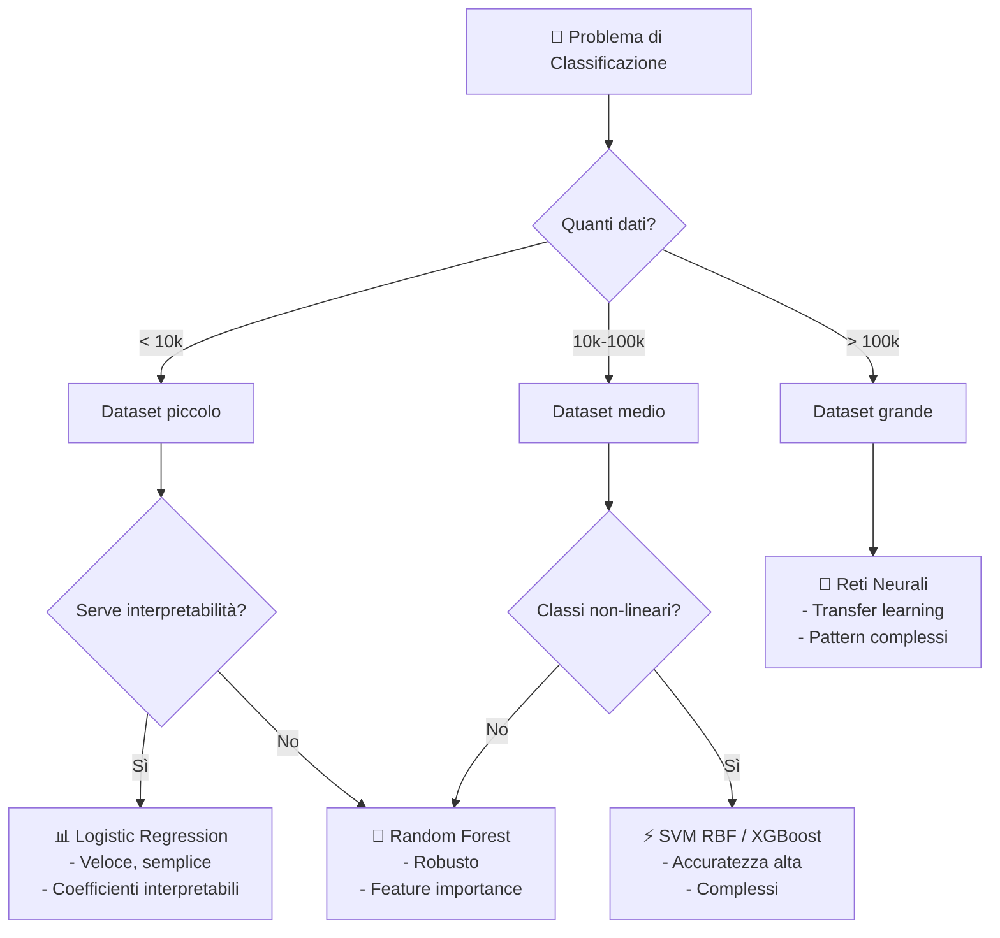
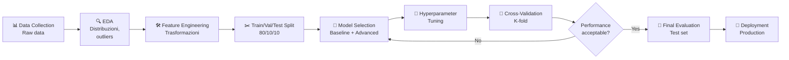

Durante il mio master in Ingegneria Elettronica, ho sviluppato modelli ML per il rilevamento di persone da segnali radar UWB. Questa esperienza mi ha insegnato che il modello "migliore" non esiste in assoluto: dipende dai dati, dal contesto e dai vincoli applicativi.

## Il problema di classificazione

Dado un set di **features** (input), predire una **classe** (output categorico):

```
Input Features:
├─ Età: 35 anni
├─ Reddito: 45.000€
├─ Score creditizio: 750
└─ Numero carte: 2

Modello ML
    ↓
Output: Classe = "Approvato" / "Rifiutato"
```

## Albero decisionale dei modelli



## Modelli principali e use case

### Comparazione modelli

| Modello | Accuratezza | Velocità | Interpretabilità | Best For |
|---------|-------------|----------|------------------|----------|
| **Logistic Regression** | ⭐⭐⭐ | ⚡⚡⚡⚡⚡ | 💯 Eccellente | Dataset piccoli, baseline |
| **SVM (RBF)** | ⭐⭐⭐⭐⭐ | ⚡⚡ | ⚠️ Black box | Classification complessa, high-dim |
| **Random Forest** | ⭐⭐⭐⭐ | ⚡⚡⚡ | ✅ Buona | Robusto, feature importance |
| **Gradient Boosting** | ⭐⭐⭐⭐⭐ | ⚡⚡ | ⚠️ Gray box | Kaggle, max accuracy |
| **Reti Neurali** | ⭐⭐⭐⭐⭐ | ⚡ | ❌ Black box | Immagini, testo, big data |

### 1. Logistic Regression

**Quando usarla:**
- ✅ Dataset piccolo (<10k samples)
- ✅ Necessaria interpretabilità
- ✅ Baseline veloce

**Quando evitarla:**
- ❌ Classi non lineari
- ❌ Molte interazioni tra features

```python
from sklearn.linear_model import LogisticRegression

# Predizione: Malattia cardiaca (0=No, 1=Yes)
# Features: [età, colesterolo, pressione, ...]

model = LogisticRegression()
model.fit(X_train, y_train)
y_pred = model.predict(X_test)

# Interpretabilità: coefficienti = importanza feature
coefficients = model.coef_[0]
# [+0.05, +0.12, -0.03, ...] → positivo=aumenta rischio
```

### 2. Support Vector Machine (SVM)

**Quando usarla:**
- ✅ Feature space di alta dimensionalità
- ✅ Buona generalizzazione
- ✅ Binary classification complessa

**Quando evitarla:**
- ❌ Dataset molto grande (>100k)
- ❌ Necessari probability estimates accurati

```python
from sklearn.svm import SVC

# Kernel RBF per classi non-lineari
model = SVC(kernel='rbf', gamma='scale')
model.fit(X_train, y_train)

# Decision boundary: hyperplane ad alta dimensionalità
```

### 3. Random Forest

**Quando usarla:**
- ✅ Dataset misto (numerico + categorico)
- ✅ Robustezza e low-variance
- ✅ Feature importance built-in
- ✅ Parallellizzabile

**Quando evitarla:**
- ❌ Necessaria interpretabilità (black-box)
- ❌ Dataset con molti outliers

```python
from sklearn.ensemble import RandomForestClassifier

model = RandomForestClassifier(n_estimators=100, max_depth=10)
model.fit(X_train, y_train)

# Feature importance
importances = model.feature_importances_
# [0.25, 0.15, 0.12, ...] → percentuale importanza
```

### 4. Gradient Boosting (XGBoost, LightGBM)

**Quando usarla:**
- ✅ Competition & Kaggle (vincitore 90% delle volte)
- ✅ Accuratezza massima
- ✅ Gestisce overfitting con early stopping
- ✅ Feature importance non-lineare

**Quando evitarla:**
- ❌ Bassa latenza richiesta
- ❌ Dataset piccolissimo
- ❌ Interpretabilità critica

```python
import xgboost as xgb

model = xgb.XGBClassifier(
    n_estimators=100,
    learning_rate=0.1,
    max_depth=5,
    early_stopping_rounds=10
)
model.fit(X_train, y_train, eval_set=[(X_val, y_val)])
```

### 5. Reti Neurali

**Quando usarla:**
- ✅ Dati non-strutturati (immagini, testo)
- ✅ Pattern complessi gerarchici
- ✅ Transfer learning disponibile
- ✅ Grande quantità di dati (>100k)

**Quando evitarla:**
- ❌ Dataset piccolo (<1k)
- ❌ Computazione device (edge)
- ❌ Interpretabilità importante

```python
import tensorflow as tf

model = tf.keras.Sequential([
    tf.keras.layers.Dense(64, activation='relu', input_shape=(n_features,)),
    tf.keras.layers.Dropout(0.3),
    tf.keras.layers.Dense(32, activation='relu'),
    tf.keras.layers.Dense(1, activation='sigmoid')  # Binary classification
])

model.compile(optimizer='adam', loss='binary_crossentropy', metrics=['accuracy'])
model.fit(X_train, y_train, epochs=20, batch_size=32, validation_split=0.2)
```

## Metriche di valutazione

Non usare solo accuracy! Dipende dal problema:

```
                    Predizione
                  Positivo | Negativo
Real   Positivo │   TP    |   FN
       Negativo │   FP    |   TN

Accuracy = (TP + TN) / Total       ← Generale
Precision = TP / (TP + FP)          ← Falsi positivi critici
Recall = TP / (TP + FN)             ← Falsi negativi critici
F1 = 2 * (Precision * Recall) / (Precision + Recall)  ← Balance
```

### Esempi:

**Spam detection** → Precision alto (non infastidire utenti)

**Diagnosi cancro** → Recall alto (non perdere casi)

**Loan approval** → F1-score equilibrato

## Workflow di ML in pratica



## Racconto dalla ricerca: UWB Person Detection

Nel mio paper su MDPI (Febbraio 2022), abbiamo confrontato modelli ML per rilevare persone da radar UWB in condizioni NLOS (non-line-of-sight):

```
Dataset: 5000 samples da diverse posizioni
Features: Raw radar signals + engineered features

Risultati:
├─ Random Forest: 94% accuracy, 50ms inference ✓
├─ SVM (RBF): 96% accuracy, 200ms inference
├─ Neural Net: 97% accuracy, 500ms inference
└─ Logistic Reg: 78% accuracy, 5ms inference

Winner: Random Forest (miglior tradeoff)
```

La scelta del modello giusto è un'arte: bilanciare accuratezza, velocità, interpretabilità e costo computazionale.
