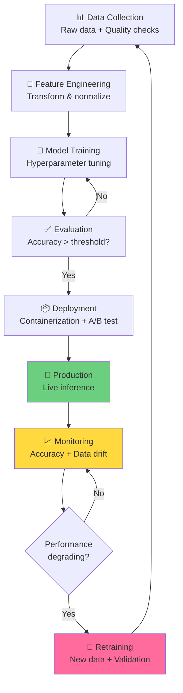

Un modello ML che funziona bene in Jupyter notebook è completamente diverso da uno che deve operare 24/7 in produzione. MLOps è la disciplina che rende questa transizione possibile, riducendo il tempo dal training al deployment e mantenendo i modelli accurati nel tempo.

## Il ciclo di vita di ML in produzione



## Il problema di Model Decay

Modelli degradano nel tempo:

```
Accuratezza nel tempo
     ↑
100% │ Training: 96% accuracy
     │
  95%│ ────────────────────
     │                  \
  90%│                   \
     │                    \_____ (Degradation)
  85%│                         \
     │                          \___
     ├────────────────────────────────→ Mesi
     0        3        6        9       12

Cause:
├─ Data drift: Distribuzione input cambia
├─ Label drift: Distribuzione output cambia
├─ Concept drift: Relazione input-output cambia
└─ Feature obsolescence: Features diventano irrilevanti

Esempio: Modello di previsione prezzo casa
├─ Training: 2020 (pre-covid)
├─ 2021: Mercato immobiliare esplode (Data drift)
└─ Accuratezza crolla senza retraining
```

## MLOps Stack Essenziale

```
┌──────────────────────────────────────┐
│         Data Ingestion               │
│    (Apache Airflow / Prefect)        │
└───────────────┬──────────────────────┘
                │
┌───────────────▼──────────────────────┐
│      Feature Store                   │
│    (Feast / Tecton)                  │
│    Versioning + Consistency          │
└───────────────┬──────────────────────┘
                │
┌───────────────▼──────────────────────┐
│      Model Training                  │
│    (AutoML / Custom pipelines)       │
│    Experiment tracking: MLflow       │
└───────────────┬──────────────────────┘
                │
┌───────────────▼──────────────────────┐
│    Model Registry                    │
│    (MLflow, DVC, Neptune)            │
│    Versioning + Staging              │
└───────────────┬──────────────────────┘
                │
┌───────────────▼──────────────────────┐
│    Model Serving                     │
│    (KServe / BentoML / Cortex)       │
│    APIs, Batch processing            │
└───────────────┬──────────────────────┘
                │
┌───────────────▼──────────────────────┐
│    Monitoring & Observability        │
│    (Datadog / Prometheus)            │
│    Drift detection, Alerts           │
└──────────────────────────────────────┘
```

## Containerizzazione di modelli

Packaging per deployment:

```dockerfile
# Dockerfile per servire un modello ML
FROM python:3.9-slim

WORKDIR /app

# Copia requirements
COPY requirements.txt .
RUN pip install -r requirements.txt

# Copia modello
COPY model.pkl .

# Copia codice servizio
COPY app.py .

# Espone porta
EXPOSE 8000

# Start server
CMD ["python", "app.py"]
```

```python
# app.py - FastAPI server
from fastapi import FastAPI
import joblib
import numpy as np

app = FastAPI()
model = joblib.load("model.pkl")

@app.post("/predict")
async def predict(features: dict):
    X = np.array([[features["age"], features["income"]]])
    prediction = model.predict(X)[0]
    return {"prediction": prediction, "confidence": 0.87}

@app.get("/health")
async def health():
    return {"status": "healthy"}
```

Deploy con Docker:
```bash
docker build -t ml-model:v1.0 .
docker run -p 8000:8000 ml-model:v1.0
```

## Experiment Tracking e Versioning

Tracciare ogni esperimento è critico:

```python
import mlflow
import mlflow.sklearn

# MLflow: Log automatico di tutto
mlflow.start_run()

mlflow.log_params({
    "model_type": "RandomForest",
    "n_estimators": 100,
    "max_depth": 10
})

model = RandomForestClassifier(**params)
model.fit(X_train, y_train)

mlflow.log_metrics({
    "accuracy": 0.94,
    "precision": 0.92,
    "recall": 0.95
})

mlflow.sklearn.log_model(model, "model")

mlflow.end_run()
```

Dashboard MLflow:
```
Run 1: accuracy=0.94, precision=0.92 (v1 baseline)
Run 2: accuracy=0.93, precision=0.94 (features nuove - peggio)
Run 3: accuracy=0.96, precision=0.95 (hyperparameters ottimizzati) ✓
Run 4: accuracy=0.95, precision=0.96 (ensemble) ?

Comparazione per scegliere quale deployare
```

## A/B Testing per Modelli

Deploy nuovo modello in produzione in sicurezza:

```
Traffic splitting:
├─ 90% utenti → Modello A (old, stabile)
├─ 10% utenti → Modello B (new, candidato)
└─ Monitora metriche per 1 settimana

Risultati:
├─ A: 96% accuracy, 150ms latency
├─ B: 97% accuracy, 180ms latency
├─ Conversione A: 3.5%
├─ Conversione B: 3.7% (+0.2%) → WIN ✓

Azioni:
├─ Aumenta traffic a B: 50% / 50%
├─ Monitora per 1 settimana
├─ Se stabile: 100% traffic a B
└─ Sunset modello A
```

## Data Drift Detection

Monitorare quando il modello vede dati diversi:

```python
# Kolmogorov-Smirnov test
from scipy import stats

train_feature = X_train[:, 0]  # Feature 1 dal training
live_feature = X_live[-1000:, 0]  # Ultimi 1000 samples produzione

statistic, p_value = stats.ks_2samp(train_feature, live_feature)

if p_value < 0.05:
    print("⚠️ Data drift detected on feature 1!")
    print(f"  p-value: {p_value}")
    print("  Trigger retraining pipeline")
else:
    print("✓ Distribution stable")
```

## Retraining Automatico

Pipeline che si auto-ritraina quando opportuno:

```yaml
# schedule.yaml - Apache Airflow DAG
from airflow import DAG
from datetime import datetime, timedelta

default_args = {
    'start_date': datetime(2024, 1, 1),
    'retries': 1
}

dag = DAG('ml_retraining', default_args=default_args, 
          schedule_interval='0 2 * * *')  # Daily 2 AM

# Task 1: Detecta drift?
check_drift = PythonOperator(
    task_id='check_drift',
    python_callable=detect_drift_function
)

# Task 2: Se drift, retrain
retrain = BranchPythonOperator(
    task_id='retrain_if_drift',
    python_callable=retrain_model_if_needed
)

# Task 3: Validazione
validate = PythonOperator(
    task_id='validate',
    python_callable=validate_model_function
)

# Task 4: Deploy
deploy = PythonOperator(
    task_id='deploy',
    python_callable=deploy_model_function
)

check_drift >> retrain >> validate >> deploy
```

## Monitoring in Produzione

Cosa monitorare:

```
┌─ Prediction Metrics
│  ├─ Latency (ms) - deve restare <500ms
│  ├─ Throughput (req/sec)
│  └─ Error rate (% requests failed)
│
├─ Model Performance
│  ├─ Accuracy (vs. true labels quando disponibili)
│  ├─ Precision/Recall
│  └─ AUC-ROC
│
├─ Data Quality
│  ├─ Missing values
│  ├─ Out-of-range features
│  └─ Distribution shifts
│
└─ Resource Usage
   ├─ CPU %
   ├─ Memory %
   └─ Disk I/O
```

Dashboard di esempio:
```
[Model Accuracy]     [Prediction Latency]    [Data Drift]
    97.2%              185ms (target: 500)     Normal
    ↓ 0.3%             ↑ +15ms                Status OK

[Throughput]         [Error Rate]             [Requests]
  2,450 req/s         0.2%                     15.2M today
  ↑ 12% vs yesterday   Normal                  ↑ 5% growth
```

## Best Practices

✅ **Version everything**
```
✓ Code: Git commits
✓ Data: DVC snapshots
✓ Models: Model registry
✓ Predictions: Audit logs
```

✅ **Automate testing**
```
✓ Unit tests per feature engineering
✓ Validation di modello (hold-out set)
✓ Integration tests (model + API)
✓ Regression tests (performance non degrada)
```

✅ **Monitoring è non-negociabile**
```
✓ Se non lo misuri, non sai se è rotto
✓ Data drift kill modelli silenziosamente
✓ Alerts proattivi salvano revenue
```

✅ **Documentazione**
```
✓ Come trainare modello (versioni esatte)
✓ Cosa fa il modello (limiti e assunzioni)
✓ Quando ritrainare (criteri e soglie)
✓ Come rollback (disaster recovery)
```

MLOps non è "bonus", è il fondamento per fare ML sostenibile in produzione. Senza di esso, non hai ML: hai un esperimento temporaneo.
