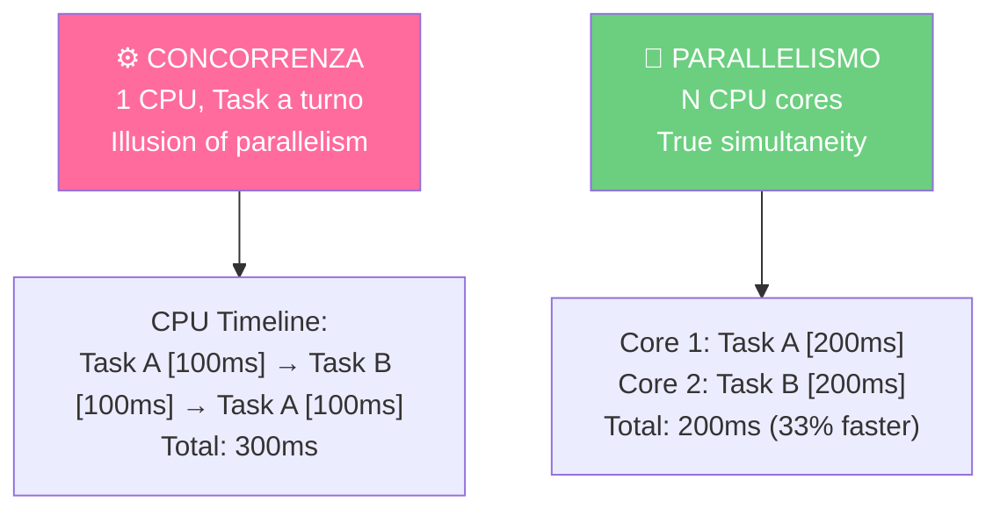

La programmazione concorrente è difficile perché il nostro cervello pensa sequenzialmente ("prima A, poi B"). Ma i computer moderni hanno più core e devono fare tante cose insieme.

## Concorrenza vs Parallelismo



## Thread in Python

```python
import threading
import time

def scarica_file():
    print("Inizio download...")
    time.sleep(2)
    print("Download completo!")

# Thread = esecuzione concorrente
thread1 = threading.Thread(target=scarica_file)
thread2 = threading.Thread(target=scarica_file)

thread1.start()
thread2.start()

thread1.join()  # Aspetta che finisca
thread2.join()

print("Entrambi finiti!")

# Output:
# Inizio download...
# Inizio download...
# Download completo!
# Download completo!
# (Tempo: ~2 secondi, non 4)
```

## Multiprocessing: Parallelismo vero

```python
from multiprocessing import Process
import time

def calcolo_pesante(n):
    risultato = sum(i**2 for i in range(n*1000000))
    print(f"Calcolato: {risultato}")

# Processo = vero parallelismo (core separati)
p1 = Process(target=calcolo_pesante, args=(100,))
p2 = Process(target=calcolo_pesante, args=(100,))

p1.start()
p2.start()

p1.join()
p2.join()

print("Fatto!")

# Sequenziale: ~4 secondi
# Parallelo (2 core): ~2 secondi
```

## Async/Await: I/O-bound

```python
import asyncio
import aiohttp

async def scarica(url):
    async with aiohttp.ClientSession() as session:
        async with session.get(url) as response:
            data = await response.text()
            print(f"Scaricato {len(data)} bytes")

# Scaricare 5 URL in "concorrenza"
async def main():
    urls = ['http://...'] * 5
    await asyncio.gather(*[scarica(url) for url in urls])

asyncio.run(main())

# Sequenziale: 5 richieste * 2s = 10s
# Async: ~2s (non aspetta, processa il prossimo)
```

## Quando usare cosa?

```
I/O-bound (Network, file):
  ├─ Thread → Semplice
  └─ Async → Efficiente, ma più complesso

CPU-bound (Calcoli):
  ├─ Multiprocessing → Vero parallelismo
  └─ Thread → NON funziona (GIL in Python)

GIL (Global Interpreter Lock) in Python:
  ├─ Solo 1 thread esegue codice Python alla volta
  ├─ Thread è concorrente ma non parallelo per CPU
  └─ Soluzione: Multiprocessing
```

## Problemi comuni

### Race Condition

```python
# SBAGLIATO: 2 thread modificano stessa variabile
counter = 0

def incrementa():
    global counter
    for _ in range(1000):
        counter += 1  # NON atomic!

t1 = threading.Thread(target=incrementa)
t2 = threading.Thread(target=incrementa)

t1.start(); t2.start()
t1.join(); t2.join()

print(counter)  # Potrebbe essere < 2000 !!
```

**Soluzione: Lock**
```python
import threading

counter = 0
lock = threading.Lock()

def incrementa():
    global counter
    for _ in range(1000):
        with lock:  # Accesso esclusivo
            counter += 1

t1 = threading.Thread(target=incrementa)
t2 = threading.Thread(target=incrementa)
t1.start(); t2.start()
t1.join(); t2.join()

print(counter)  # Adesso sempre 2000 ✓
```

### Deadlock

```python
# SBAGLIATO: Circolo di aspettative
lock1 = threading.Lock()
lock2 = threading.Lock()

def task1():
    with lock1:
        time.sleep(0.1)  # Dai tempo a task2
        with lock2:      # Aspettiamo lock2... ma task2 l'ha!
            pass

def task2():
    with lock2:
        time.sleep(0.1)
        with lock1:      # Aspettiamo lock1... ma task1 l'ha!
            pass

t1 = threading.Thread(target=task1)
t2 = threading.Thread(target=task2)
t1.start()
t2.start()
t1.join()  # DEADLOCK: aspetta infinitamente!
```

Concorrenza è potente ma pericolosa. Usa sempre locks per variabili condivise.
