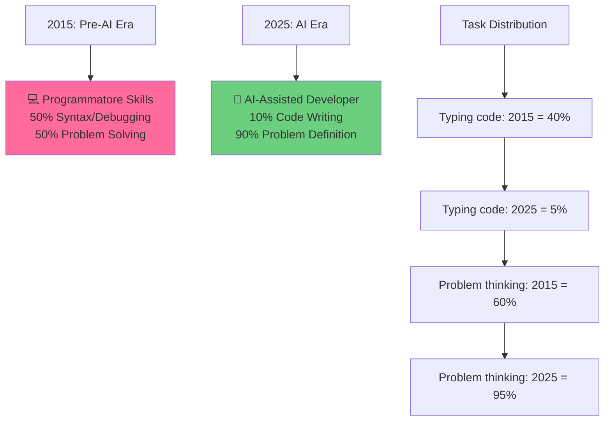

Uno studente della mia classe mi ha chiesto: "Prof, perché imparare a programmare se ChatGPT lo fa per me?"

Domanda legittima. Risposta complessa. Amo questa domanda perché costringe a ripensare cosa significhi insegnare programmazione oggi.

## La paura sbagliata

La paura più comune:
```
ChatGPT genera codice
  └─ Programmatori non servono più
     └─ Perché imparare?
```

Sbagliato. Esattamente come:
```
Google sa tutto
  ❌ Perché imparare storia?
  
Calcolatori fanno conti perfetti
  ❌ Perché imparare matematica?
  
Auto a guida autonoma
  ❌ Perché imparare a guidare?
```

**L'IA non vi rende inutili. Vi rende più utili se sapete usarla bene.**

## Quello che NON cambia

```
1. PENSIERO LOGICO
   ChatGPT non ha senso logico naturale
   Sbaglia se il problema è malformulato
   TU devi dire COSA fare (problema ben definito)

2. DEBUG
   ChatGPT genera 70% codice giusto
   Il rimanente 30% va fixato
   Senza sapere programmazione = bloccato

3. ARCHITETTURA
   AI può generare funzioni
   Solo TU decidi come assemblarle
   Monolite vs. Microservizi? Dipende dalle esigenze

4. ETICA e RESPONSABILITÀ
   ChatGPT copia da training data
   Tu sei responsabile legalmente del codice usato
   Devi capire cosa fa per certificarlo
```

## Quello che CAMBIA



RISULTATO: Programmatori più veloci, ma devono sapere di più
```

## Come imparare a programmare in era di IA

### ✅ Approccio nuovo

**1. Impara il problema, non la sintassi**

```
SBAGLIATO:
"Come si scrive un ciclo for in Python?"
→ ChatGPT: 5 secondi

GIUSTO:
"Devo verificare se un numero è primo. Come la pensi?"
→ Dialogo: Qual è l'algoritmo? Quando fermarsi? Edge cases?
→ ChatGPT aiuta a tradurre in codice
```

**2. Usa AI come sparring partner**

```python
# Tu scrivi la logica
def is_prime(n):
    if n < 2:
        return False
    for i in range(2, int(n**0.5) + 1):
        if n % i == 0:
            return False
    return True

# Chiedi a ChatGPT di migliorare
# "Può questa funzione gestire numeri negativi?"
# "Come potremmo farla più veloce per numeri grandi?"
```

**3. Debug attivamente**

```
Output atteso: [2, 3, 5, 7]
Output ChatGPT: [2, 3, 5, 7, 9] ← SBAGLIATO
Errore: 9 non è primo

Azioni:
├─ Capisco perché sbaglia (condizione sul loop)
├─ Correggo manualmente o riformullo a ChatGPT
└─ Imparo dal perché è stato sbagliato
```

## Esempio: Ordinamento di una lista

### Modo tradizionale
```
1. Impara QuickSort
2. Scrivilo in Python
3. Debugga 2 ore
4. Capisci finalmente
```

### Modo con IA (2025)
```
1. "ChatGPT, ordina una lista"
   → ChatGPT: built-in function sorted()
2. "Perché sorted() è meglio che QuickSort manuale?"
   → ChatGPT: Explain time complexity
3. "Dimmi quando QuickSort è più veloce"
   → Capisco il tradeoff
4. "Implementa QuickSort per imparare"
   → Capisco il meccanismo
```

Risultato: Imparare più veloce, capisco i concetti, non wasto tempo su boilerplate.

## Le competenze che l'IA NON può fare (ancora)

```
✓ Scrivere codice da specifica chiara
✗ Definire la specifica giusta
  → Solo TU capisci il problema del cliente

✓ Trovare bug ovvio
✗ Testare sistemi complessi
  → Serve creatività umana per test cases diabolici

✓ Tradurre logica in Python
✗ Scegliere l'architettura
  → Quali database? Monolite o microservizi? Cache o non cache?

✓ Generare documentazione
✗ Capire cosa è importante
  → Servono decisioni umane su priorità
```

## Consiglio ai ragazzi

```
❌ Non evitare programmazione perché "c'è l'IA"
   Sarebbe come in 1995 dire "non imparo HTML perché uso Dreamweaver"
   Sarebbe come 1970 dire "non imparo a usare i computer perché sono lenti"

✅ IMPARA i FONDAMENTI
   ├─ Pensiero logico
   ├─ Strutture dati (array, oggetti, liste)
   ├─ Algoritmi (sorting, searching, ricorsione)
   └─ Problem-solving

✅ USA AI come TOOL
   ├─ ChatGPT per scaffolding veloce
   ├─ Copilot per suggerimenti
   └─ Ma capisci cosa fa

✅ SPECIALIZZATI in QUALCOSA
   ├─ Non "programmazione generica"
   ├─ Ma "backend per e-commerce", "ML per immagini", "giochi"
   └─ Qui l'AI è un assistente, non concorrenza
```

## Il parallelo con la matematica

Nel 1970, arrivò la calcolatrice. I professori dicevano:
```
"Perché imparare moltiplicazioni se la calcolatrice le fa?"
```

Risposta: Perché il problema non è "calcola 47 * 23". È "come si risolve questa equazione?" o "questo risultato ha senso?"

Allo stesso modo oggi:
```
"Perché imparare Python se ChatGPT lo genera?"
```

Risposta: Perché il problema non è "scrivi un loop". È "come risolvo questo problema?" e "questo codice è corretto?"

La programmazione in era IA non è "scrivere codice", è **"pensare in modo computazionale usando strumenti moderni"**.
