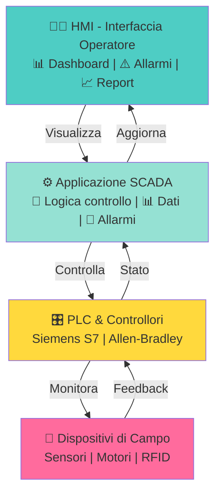
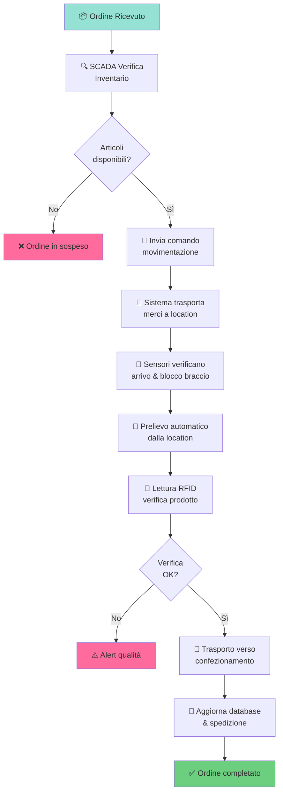

Un sistema SCADA (Supervisory Control and Data Acquisition) è fondamentale per automatizzare e monitorare le operazioni di magazzino moderno. Durante il mio lavoro in NGTEC, ho sviluppato soluzioni SCADA per controllare sistemi di movimentazione automatica, gestire inventari in tempo reale e ottimizzare i flussi logistici.

## Architettura di un sistema SCADA per magazzini

Un'architettura SCADA tipica per magazzini automatici si compone di diversi strati:

## Componenti chiave

### 1. **Sensori e Input**
- Sensori di movimento per il tracciamento merci
- Lettori RFID per identificazione prodotti
- Sensori di pressione e temperatura
- Contatori di pezzi

### 2. **Controller Logico Programmabile (PLC)**
Il PLC è il "cervello" del sistema. Gestisce:
- Cicli di movimentazione automatica
- Sincronizzazione tra diversi assi
- Protezioni di sicurezza
- Feedback dai sensori

### 3. **Applicazione SCADA**
Realizzata tipicamente con:
- **FactoryTalk** (Rockwell Automation)
- **TIA Portal** (Siemens)
- **Ignition** (Inductive Automation)
- **Soluzioni custom** in C# / Python

## Implementazione: Flusso di un ordine di prelievo

## Vantaggi di un SCADA ben progettato

- **Efficienza**: Riduzione tempi di prelievo del 60-70%
- **Accuratezza**: Inventario sempre aggiornato
- **Tracciabilità**: Cronologia completa delle movimentazioni
- **Sicurezza**: Protezioni e interblocchi automatici
- **Manutenzione predittiva**: Monitoraggio consumi e usura

## Tecnologie utilizzate

Nel progetto che ho seguito in NGTEC abbiamo utilizzato:

| Componente | Tecnologia | Motivo della scelta |
|-----------|-----------|-------------------|
| **PLC** | Siemens S7-1200 | Affidabilità industriale, ecosistema maturo |
| **HMI** | Pannello touchscreen Siemens KTP | Integrazione native con PLC, interfaccia robusta |
| **Comunicazione** | PROFIBUS DP | Determinismo real-time, bassa latenza |
| **Database** | SQL Server | Storicizzazione dati, report avanzati |
| **Networking** | VLAN OT/IT separate | Sicurezza e isolamento critico |

Un sistema SCADA ben progettato è l'ossatura dell'Industria 4.0: permette di collegare macchine, sensori e sistemi informativi in un ecosistema coeso e controllato.
